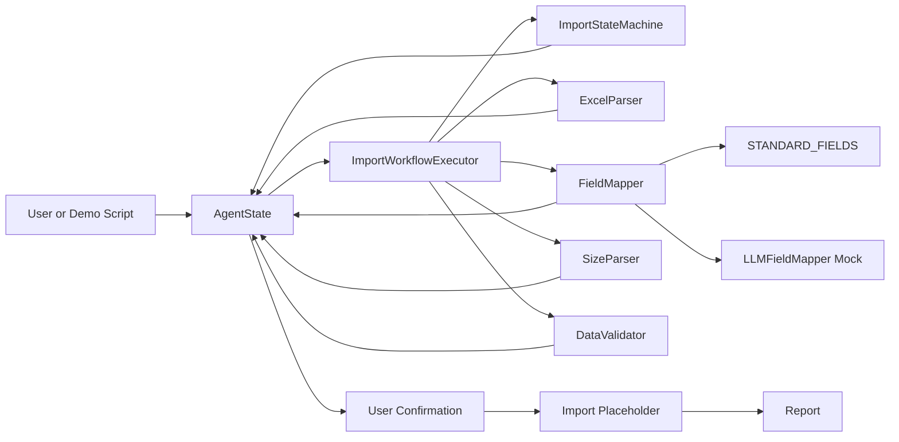
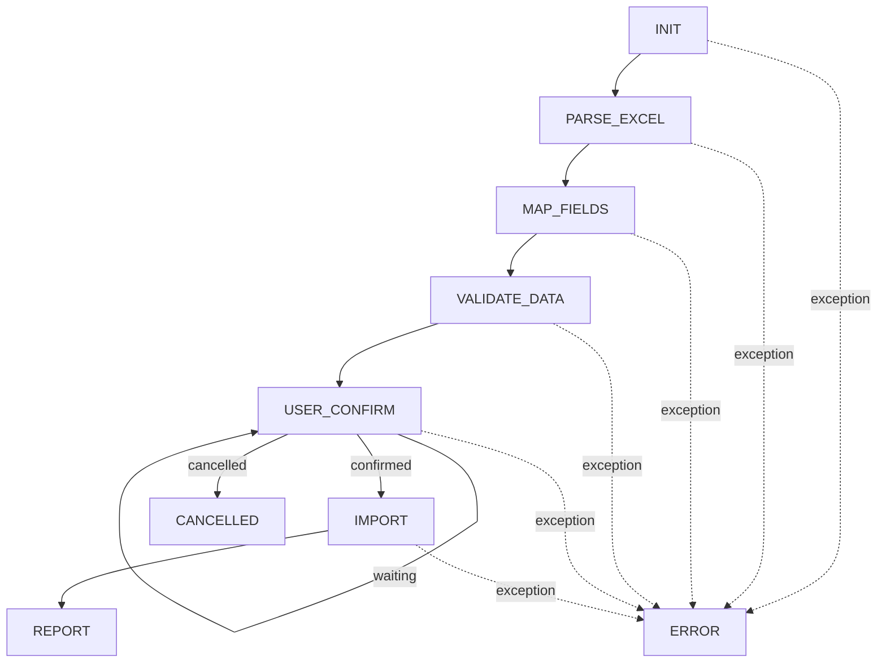
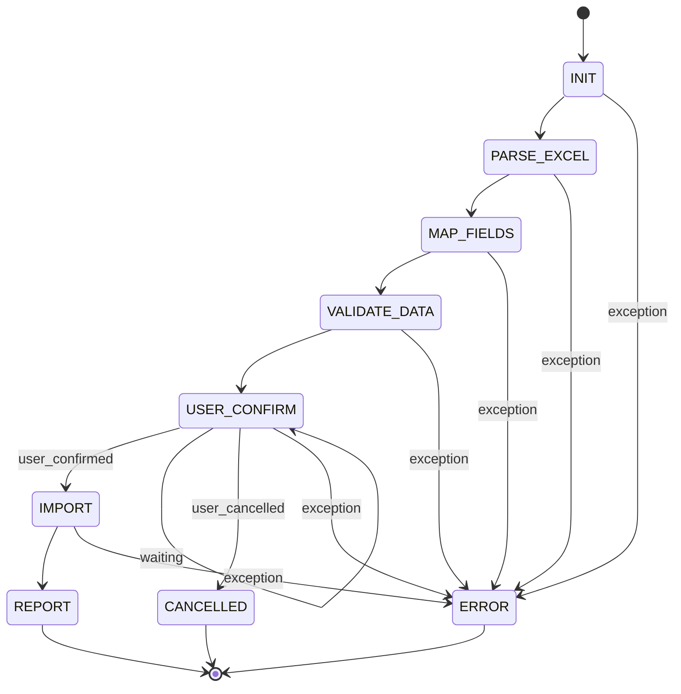
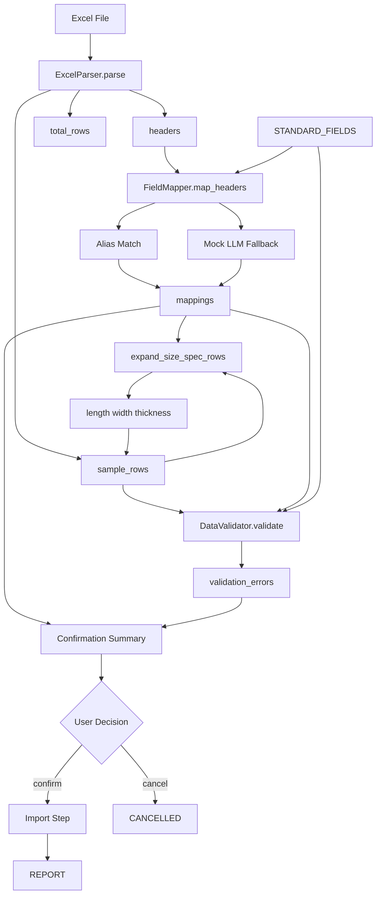

# Architecture

Mini Import Agent is a Python prototype for importing Excel data through a deterministic agent workflow. The current implementation focuses on local execution: it parses an Excel file, maps source columns to standard fields, expands composite size values, validates sample rows, waits for user confirmation, then reaches an import and report phase.

The project is organized around an explicit state object and a state machine. Tools are small, single-purpose components, while `ImportWorkflowExecutor` coordinates the end-to-end workflow.

## Project Architecture



## Folder Structure

```text
mini-import-agent/
├── agent/
│   ├── state.py              # Workflow states and Pydantic state models
│   └── README.md
├── demo/
│   ├── demo_import_agent.py
│   ├── demo_import_agent_cancel.py
│   ├── demo_import_agent_invalid.py
│   ├── demo_import_agent_llm_headers.py
│   ├── demo_import_agent_wait_confirm.py
│   ├── demo_field_mapper.py
│   ├── demo_llm_field_mapper.py
│   └── demo_size_parser.py
├── docs/
│   ├── architecture.md
│   ├── deployment.md
│   ├── roadmap.md
│   └── workflow.md
├── knowledge/
│   └── standard_fields.py    # Canonical import fields, aliases, and required flags
├── memory/
│   └── README.md             # Placeholder for future memory capability
├── tools/
│   ├── data_validator.py     # Required-field and numeric validation
│   ├── excel_parser.py       # Excel header and sample-row parser
│   ├── field_mapper.py       # Alias-first field mapping
│   ├── llm_field_mapper.py   # Mock LLM fallback mapper
│   └── size_parser.py        # Composite size parser
├── workflow/
│   ├── executor.py           # Workflow orchestration
│   └── state_machine.py      # State transitions and terminal states
├── sample.xlsx
├── sample_invalid.xlsx
├── sample_llm_headers.xlsx
└── README.md
```

## Workflow

The active workflow is linear, with two terminal failure paths: `ERROR` and `CANCELLED`.



## Components

### Agent State

`agent/state.py` defines the state model shared by every workflow step.

- `WorkflowState`: lifecycle states from `INIT` through `REPORT`, plus `ERROR` and `CANCELLED`.
- `AgentState`: task data, current state, file path, parsed headers, sample rows, mappings, validation errors, import result, user flags, errors, and history.
- `FieldMappingItem`: source header, target field, confidence, reason, and mapping source.
- `ValidationError`: row, field, message, and severity.
- `HistoryItem`: auditable step history with timestamps.

### Workflow Executor

`workflow/executor.py` owns the orchestration. It calls the correct component for the current state and mutates `AgentState` with each result.

- Initializes a task.
- Parses Excel metadata and sample rows.
- Maps headers to standard fields.
- Expands `size_spec` into `length`, `width`, and `thickness` when possible.
- Validates required and numeric fields.
- Builds a confirmation summary.
- Stops for user confirmation when needed.
- Moves to import and report states after confirmation.

### State Machine

`workflow/state_machine.py` defines allowed transition order and terminal states.

- Normal order: `INIT`, `PARSE_EXCEL`, `MAP_FIELDS`, `VALIDATE_DATA`, `USER_CONFIRM`, `IMPORT`, `REPORT`.
- Terminal states: `REPORT`, `ERROR`, `CANCELLED`.
- Exceptions are converted into `ERROR` with structured error information.

### Tools

- `ExcelParser`: reads an Excel sheet with pandas and returns headers, first five sample rows, and total row count.
- `FieldMapper`: maps headers by exact alias first, then case-insensitive alias, then mock LLM inference.
- `LLMFieldMapper`: mock fallback that infers selected Chinese business headers from text.
- `SizeParser`: parses values like `1000x500x20` into `length`, `width`, and `thickness`.
- `DataValidator`: validates required fields from `STANDARD_FIELDS` and numeric fields.

### Knowledge

`knowledge/standard_fields.py` is the current knowledge base. It defines canonical fields, display names, aliases, and whether each field is required.

## State Machine



## Data Flow


