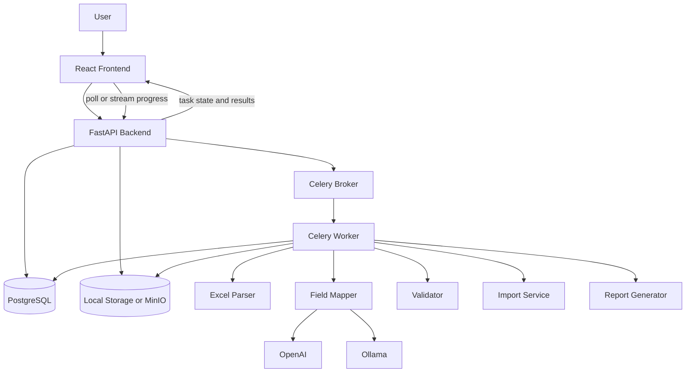
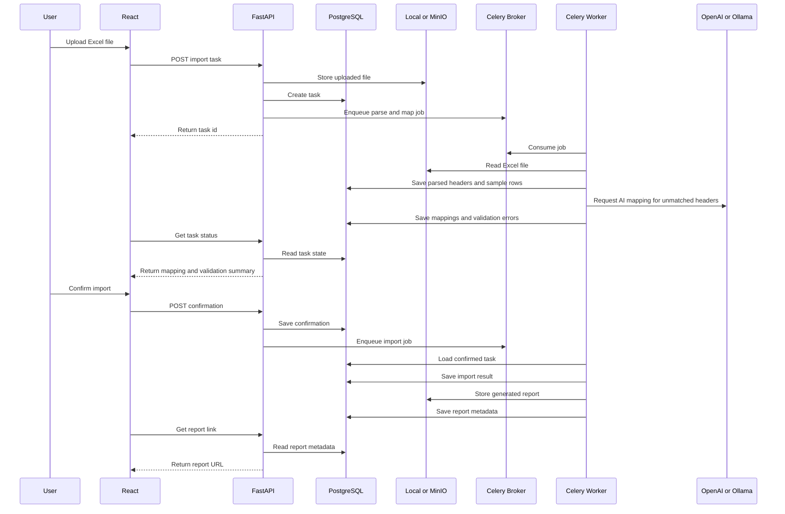
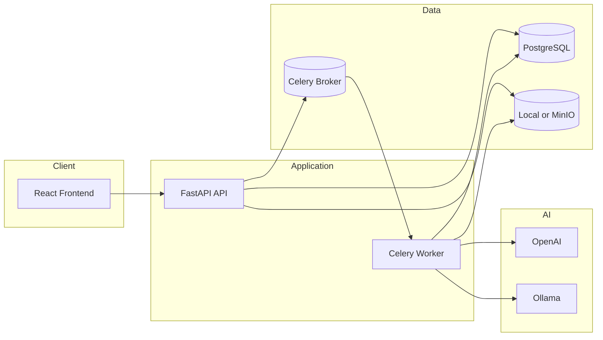

# Deployment

This document describes a future deployment architecture for Mini Import Agent. The current repository is a local Python prototype. The target deployment separates the user interface, API, background workers, database, storage, and LLM providers.

## Target Stack

Frontend:

- React

Backend:

- FastAPI

Database:

- PostgreSQL

LLM:

- OpenAI
- Ollama

Worker:

- Celery

Storage:

- Local
- MinIO

## Deployment Architecture

## Component Responsibilities

### React Frontend

The frontend will provide the interactive import experience.

- Upload Excel files.
- Display parsing results and detected headers.
- Show field mappings and confidence scores.
- Allow users to correct mappings.
- Display validation errors and fix suggestions.
- Ask for final confirmation.
- Show workflow progress.
- Download generated reports.

### FastAPI Backend

The backend will expose import task APIs and coordinate persistent workflow state.

- Create import tasks.
- Accept file uploads.
- Store uploaded files.
- Start Celery jobs.
- Return task status.
- Save user mapping corrections.
- Accept confirmation or cancellation.
- Provide report download links.

### PostgreSQL

PostgreSQL will persist business and workflow data.

- Import tasks.
- Workflow state.
- Uploaded file metadata.
- Parsed headers.
- Field mappings.
- Validation errors.
- User decisions.
- Import results.
- Report metadata.

### LLM Providers

The mapping layer can support both cloud and local model providers.

- OpenAI for production-grade hosted inference.
- Ollama for local or private model inference.
- Provider selection can be configured per environment or tenant.
- Deterministic alias matching should still run before LLM inference.

### Celery Worker

Celery workers will run long-running import tasks outside the request lifecycle.

- Parse Excel files.
- Run deterministic and AI field mapping.
- Expand size specifications.
- Validate rows.
- Execute imports.
- Generate reports.
- Update task progress in PostgreSQL.

### Storage

Storage will hold uploaded source files and generated output files.

- Local storage for development and simple deployments.
- MinIO for S3-compatible object storage in production-like deployments.
- Reports can be written to storage and referenced from PostgreSQL.

## Future Runtime Flow

## Environment Layout

## Deployment Notes

- Development can run with React, FastAPI, Celery, PostgreSQL, and local storage on one machine.
- Production-like deployments should use MinIO or another S3-compatible store for uploaded files and reports.
- LLM provider credentials should be injected through environment variables or a secret manager.
- Celery workers should be horizontally scalable because Excel parsing, LLM mapping, validation, and report generation are background workloads.
- Workflow state should be stored in PostgreSQL so users can leave and resume import tasks.
