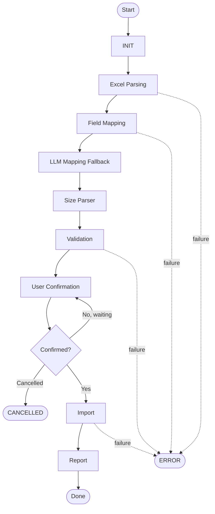
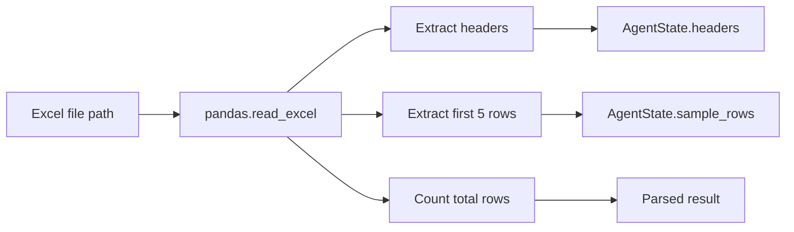
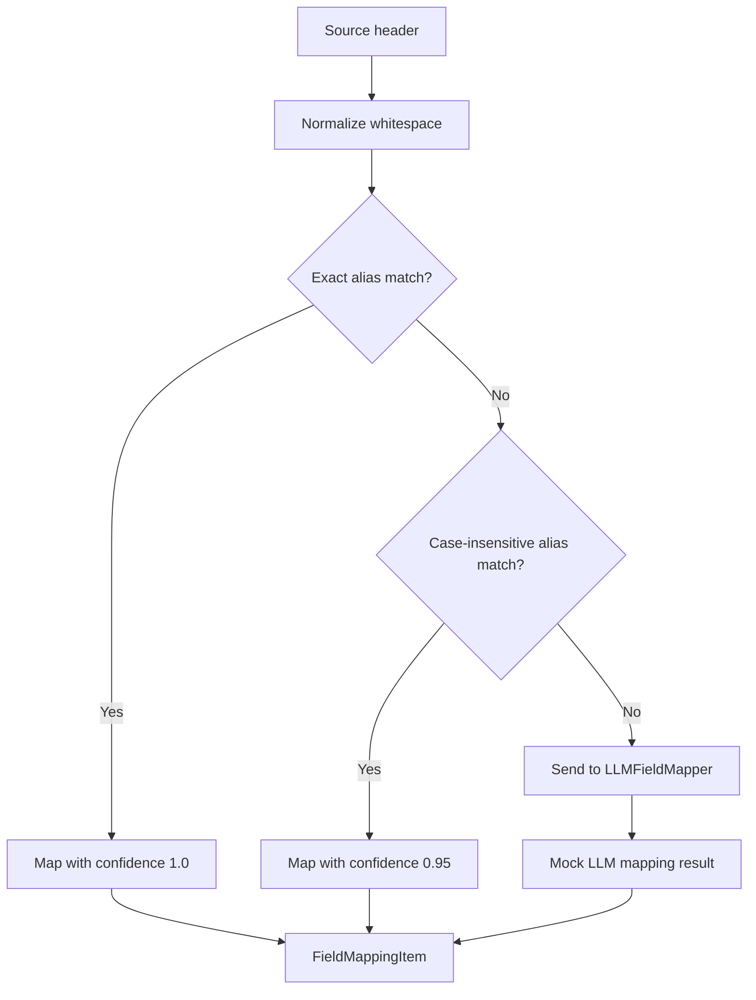
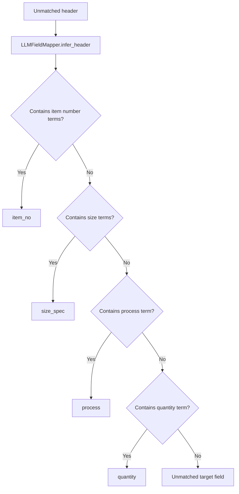
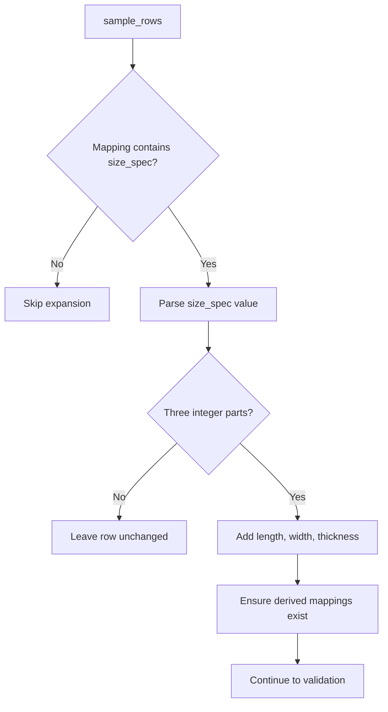
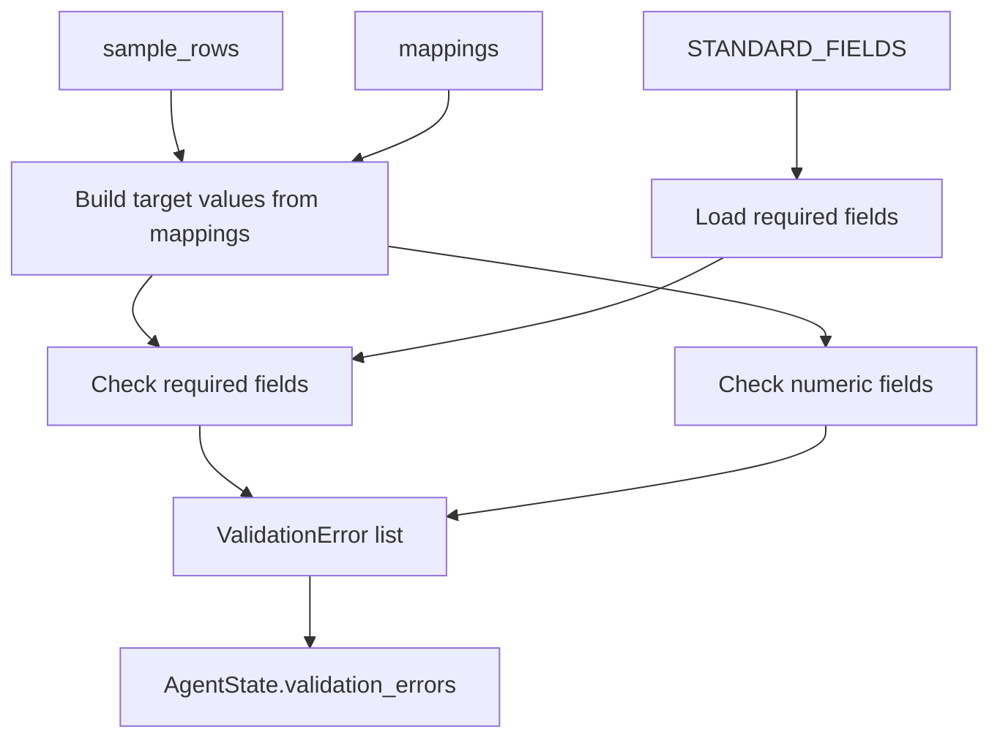
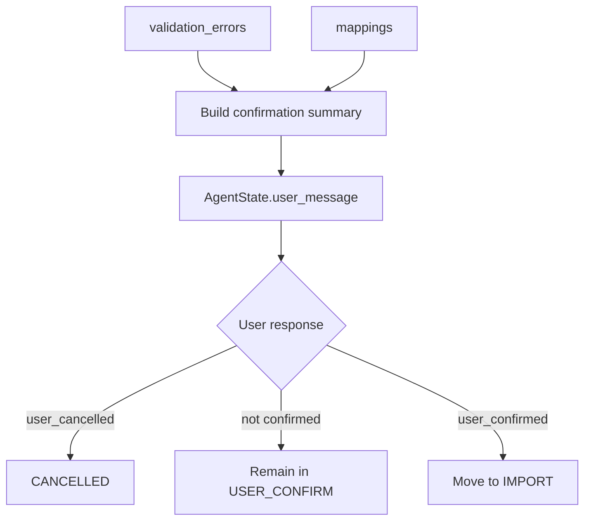
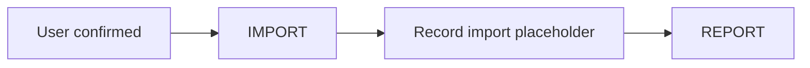
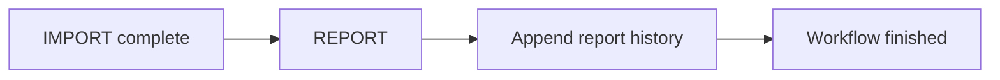

# Workflow

The import workflow is implemented by `ImportWorkflowExecutor`. It advances an `AgentState` through a deterministic state machine and pauses at user confirmation when the import needs approval.



## Excel Parsing

Excel parsing happens in the `PARSE_EXCEL` state.

`ExcelParser` reads the configured file path with pandas and returns:

- `headers`: column names from the selected sheet.
- `sample_rows`: first five rows converted to dictionaries.
- `total_rows`: total rows in the sheet.



## Field Mapping

Field mapping happens in the `MAP_FIELDS` state. The mapper compares source headers with aliases in `STANDARD_FIELDS`.

Mapping priority:

1. Exact normalized alias match.
2. Case-insensitive normalized alias match.
3. Mock LLM fallback.



## LLM Mapping

The current LLM mapper is a mock implementation, not a remote model call. It infers a few business headers from text and marks unmatched headers with an empty target field.

Current mock inference examples:

- Headers containing `货号` or `产品编号` map to `item_no`.
- Headers containing `规格` or `尺寸` map to `size_spec`.
- Headers containing `加工方式` map to `process`.
- Headers containing `块数` map to `quantity`.



## Size Parser

The size parser runs during `VALIDATE_DATA` before validation. If a source header maps to `size_spec`, the workflow attempts to parse each row value into separate dimensions.

Supported separators include `x`, `X`, `*`, and `脳`. Values must contain exactly three integer parts.

Example:

```text
1000x500x20 -> length=1000, width=500, thickness=20
```



## Validation

Validation checks sample rows using the mapped target fields.

Current rules:

- Required fields are read from `STANDARD_FIELDS`.
- Required fields must not be empty.
- Numeric fields `length`, `width`, and `height` must be numeric when provided.

Note: `thickness` exists as a standard field and can be derived by the size parser. The current numeric validation set does not include `thickness`.



## User Confirmation

The workflow enters `USER_CONFIRM` after validation. It builds a text summary containing field mappings, validation results, fix suggestions, and a recommendation.

If validation errors exist, the recommendation is user review. If no errors exist, the recommendation is safe to import.



## Import

The `IMPORT` state currently records an import history entry and moves to `REPORT`. It is a placeholder for a future real import API or database write.



## Report

The `REPORT` state is the successful terminal state. The current implementation records that the report step completed.

Future report behavior can include:

- Import totals.
- Failed row details.
- Validation and mapping summary.
- Downloadable report URL.


